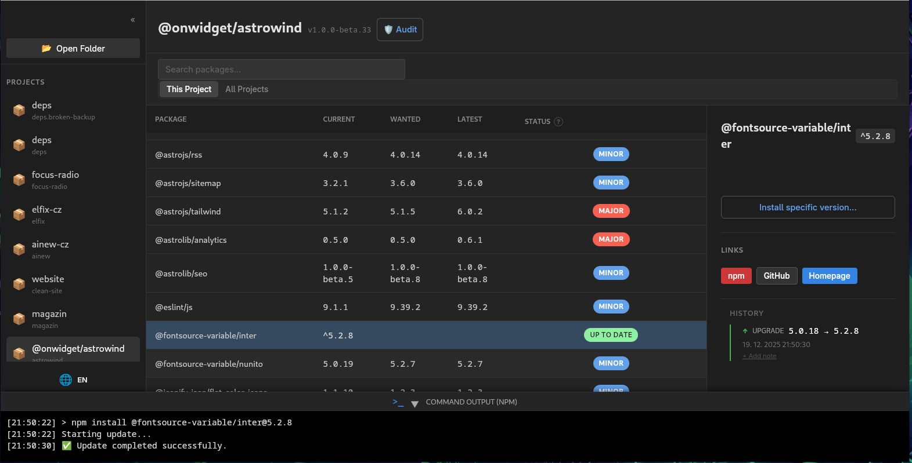

# Deps

**Deps** is a native Linux desktop application for managing Node.js dependencies effortlessly. Designed for developers who manage multiple projects and want a clear, unified view of their dependency health without context switching.



---

## 🚀 Features

### 📦 Dependency Management
- **Visual Overview**: Instantly see `dependencies` and `devDependencies` for your project.
- **Version Intelligence**:
  - **Current**: What is installed.
  - **Wanted**: What `package.json` allows.
  - **Latest**: The newest version available on npm.
- **Smart Updates**:
  - 🟢 **Green**: Up-to-date.
  - 🟠 **Orange**: Minor/Patch updates (safe).
  - 🔴 **Red**: Major updates (breaking changes).
- **One-Click Actions**: Update packages or install specific versions directly from the UI.

### 🔍 Global Search
- **Cross-Project Search**: Search for a package (e.g., `react`) across **all** your loaded projects instantly.
- **Scope Control**: Toggle between searching within the "This Project" or "All Projects".
- **Deep Linking**: Click a result to jump directly to that project's context.

### 🛡️ Security Audit
- **Integrated npm audit**: Run security scans with one click.
- **Vulnerability Reports**: View detailed vulnerability info (severity, path, advisory).
- **Auto-Fix**: Run `npm audit fix` directly from the app to resolve common issues.

### 📂 Workspaces & Navigation
- **Sidebar Navigation**: Switch between multiple active projects quickly.
- **Read-Only Protection**: Visual indicators and locked actions for projects where you don't have write permissions.

### 🌍 Localization
- Fully localized interface (English / Czech).

---

## 🛠️ Installation

### Linux
Deps is distributed as **AppImage**, **DEB**, and **RPM**.
Download the latest release from the [Releases Page](../../releases).

**AppImage (Universal):**
```bash
chmod +x Deps-x.x.x.AppImage
./Deps-x.x.x.AppImage
```

---

## 💻 Development

Prerequisites:
- **Rust** (stable)
- **Node.js** (LTS) & **npm**
- Linux development headers (webkit2gtk, etc.)

### Setup
```bash
# Install dependencies
npm install

# Run in development mode (Tauri + Vite)
npm run tauri dev
```

### Building
To build a release package:
```bash
npm run tauri build
```
*Note: Building RPM/DEB requires `rpm-build` and `dpkg` installed on your system.*

---

## 🧱 Technology Stack

- **Core**: [Tauri v2](https://v2.tauri.app/) (Rust)
- **Frontend**: React + TypeScript + Vite
- **Styling**: Native CSS (Dark Mode optimized)
- **State Management**: React Hooks + Tauri Store

---

## 🔒 Privacy & Philosophy

- **Local First**: No cloud accounts, no tracking. Everything runs on your machine.
- **Native Performance**: Built with Rust for minimal resource usage compared to Electron.
- **Transparent**: Executes standard `npm` commands under the hood. You remain in control.
